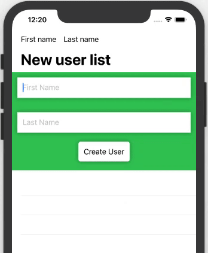
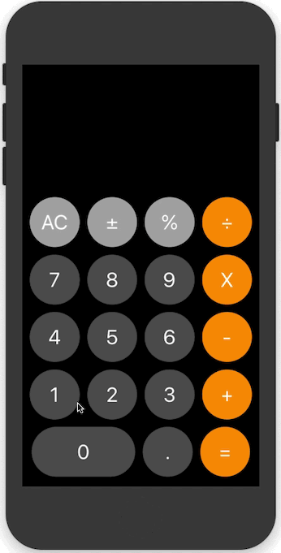
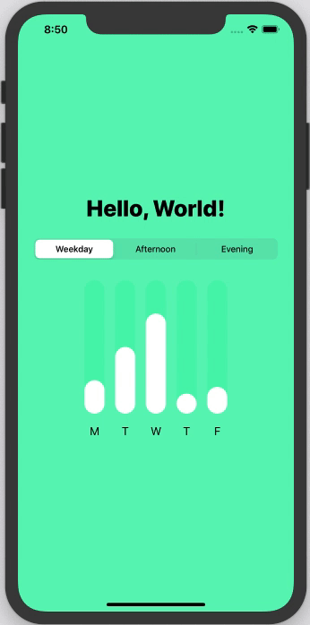
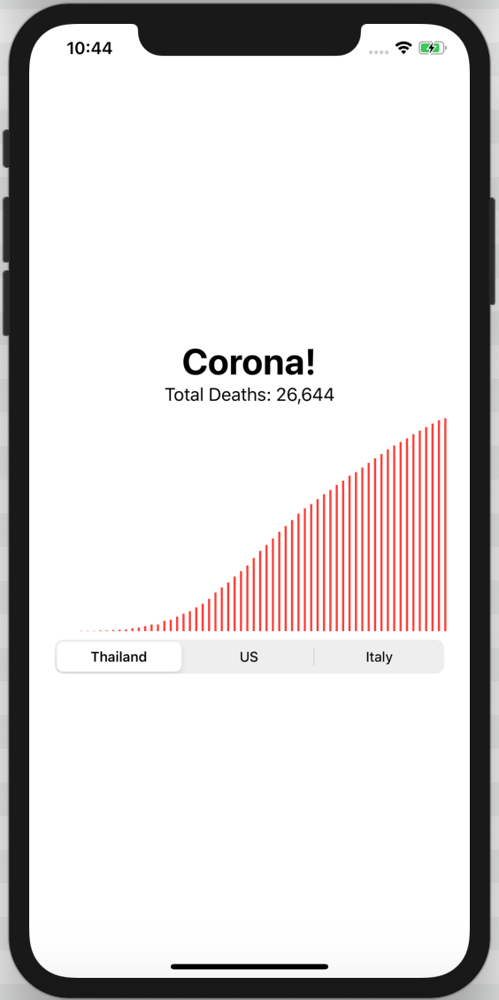

# SwiftUI-Patterns

A compilation of code used to improve my SwiftUI skills — the techniques and systems code are coming from my classes made in different courses. Enjoy it!

credits for [bhlvoong](https://github.com/bhlvoong) 

## SwiftUI Reactive Intro: State Management and Bindings

Lots to like about the SwiftUI framework that is very modern. The concept of reactive programming in the native library can now be implemented using State variables that are Bindable in your application that use SwiftUI.

## SwiftUI Calculator

Creating a two dimensional grid of buttons using Enumeration, Switches and Reactive Environment Object Application State

## SwiftUI Animated Bar Charts and Picker Segmented Style Binding

Improvements to come along is the ability to add animations

## SwiftUI Charts With JSON ViewModels

## Better Previews with PreviewLayout PreviewDevice and ColorSchemes
