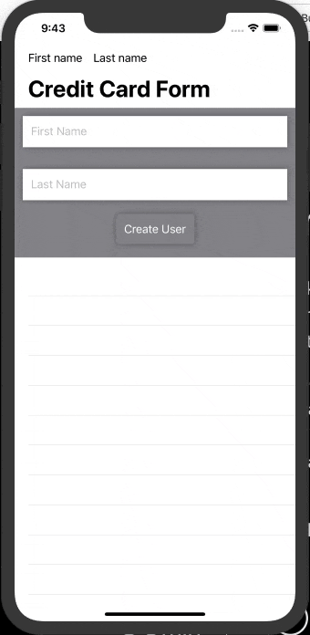

# SwiftUI-Intro

## SwiftUI Reactive Intro: State Management and Bindings

Lots to like about the SwiftUI framework that is very modern. The concept of reactive programming in the native library can now be implemented using State variables that are Bindable in your application that use SwiftUI.

